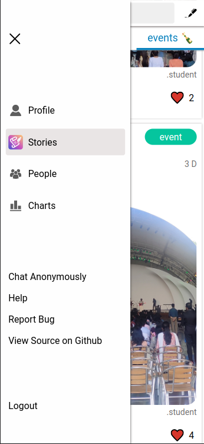

## Table of contents

1. Signup
2. Login
3. Profile
4. Stories
5. People
6. Search
7. Installing the app
8. Admins

### 1 Signup

**tag:** The tag is the name with which people can tag you with. using @ eg: (@paul2)

**college email:** This is your organization email that is allowed by your organization.

**password:** used to create a new password when registering.

**select department**: select your department that you belong to from the dropdown

then once you click on the next button you will be sent an activation email. 

Open the mail and click on activate account, after which you can login.

### Login

Enter your credentials and Login.

### Interface

### Profile