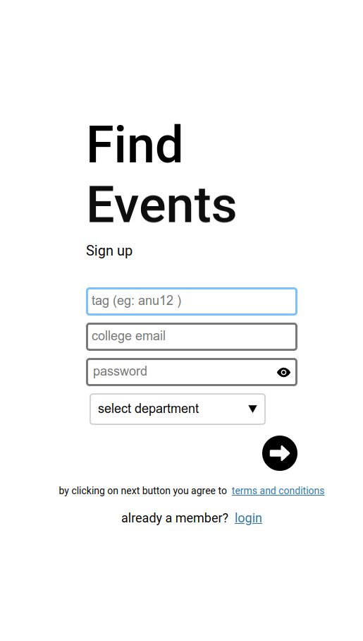

## Table of contents

1. Signup
2. Login
3. Profile
4. Stories
5. People
6. charts
7. Search
8. Installing the app
9. Admins

### 1 Signup

**tag:** The tag is the name with which people can tag you with, this has to be unique and is permanet throughout the lifetime of your account. using @ eg: (@paul2)

**college email:** This is your organization email that is allowed by your organization.

**password:** used to create a new password when registering.

**select department**: select your department that you belong to from the dropdown

then once you click on the next button you will be sent an activation email. 

Open the mail and click on activate account, after which you can login.

### Login

Enter your credentials and Login.

### Interface

 

 

### Profile

 

**Updating your profile**

You can also update your profile and bio by clicking on the pen icon

**Liking and sendind requests**

You can like peoples profile by visiting their profile. Once you like their profile you  will be notified when the user posts a story.

You can also send request by clicking on the button to the right of the like buttton. Once you send we will notify the user.

**profile tabs**

You can add links to your other profiles, add your achievements, add your
skills and write a comment about the user besides you under the remarks tab.

### stories 

Stories are what you wish to share to the people in your organization.

Stories can be an event, request or just a plain story.

**Writing story**

You can start wrting a story by clicking on the pen icon on the top right corner.

You can make use of the drop-down to select the type of the story (eg: story(default), event, request).

**story**: Stories can be anything, including picture of you the cafeteria, or just some random thought that came to your mind. 

**Event**: You can mark a particular story an event, once you mark it as an event you can notify specific departments, by using d/departmentname. If you want to notify all the departments use d/all.

**request**: You can request for a specified skill using # followed by the skill name eg: #reactjs, so this will notify all the people who have reactjs as one of their skills.

### People

**Peoples tab**

Peoples tab is where you can vote people based on what they are, eg you can vote for people who are funny by clicking on the drop-down and the emoji icon beside each user.

**Requests tab**

The requests tab is where you vote to open a new category, so you can start voting people based on the category.

### Charts-tab

The stats for nerds are made for data scientists, ML & AI enthuists and others who are interested in knowing from which departments the specified skilled people come from.

### search

**basic search**
You can search users by name, email or tag name.

**advanced search**
you can search users based on skill or achievements or name starting with, or combine all these queries using the following queries

Use the following queries in the search bar.

**searching users by skills**

`skills=skillname1,skillname2|skillname3`

Note the `,` stands for and and `|` represents or.

The `,` is evaluated first and then the `|`. Also no spaces between `,` and `|`, you can combine them in any order.

**searching users by achievements**
`achievements=achievement1,achievement2|achievement3`

**searching based on names**
`name=pau`

The above query returns anyones name starting with pau

**combining queries**
You can also combine theses queries to filter out through a lot of results by seperating them with a semicolon `;`

`skills=skill1|skill2; name=pau; achievements=nobel prize`